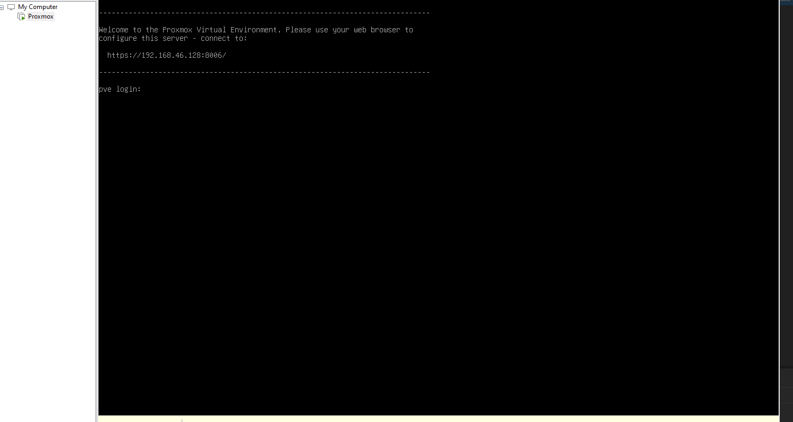
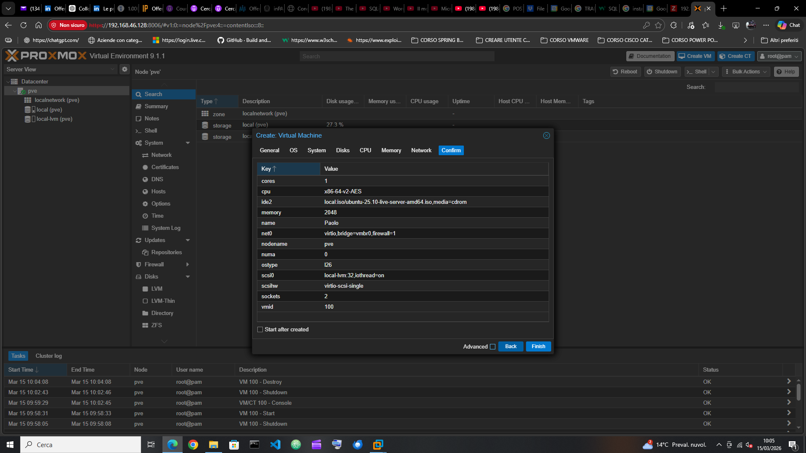
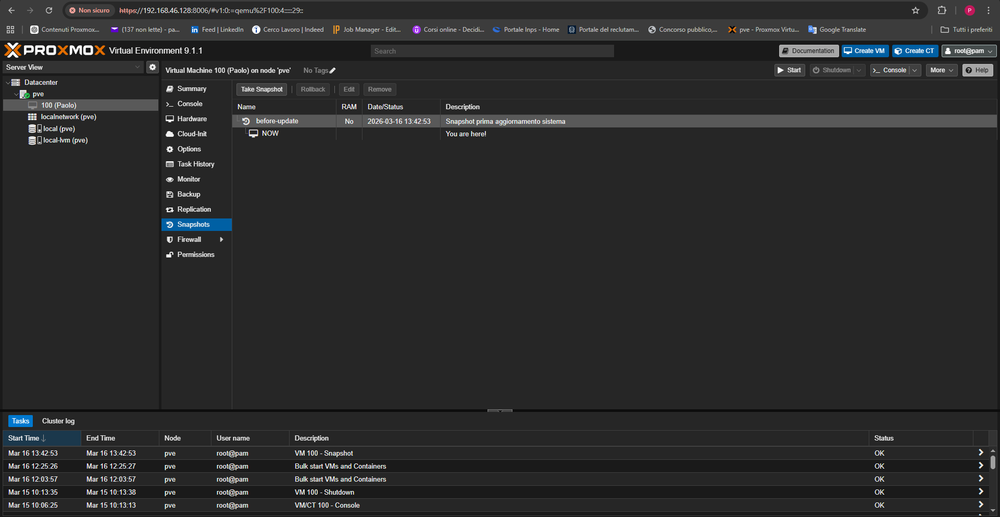

# proxmox-lab
Proxmox VE installation and first virtual machine creation
# Proxmox lab

Laboratorio personale di virtualizzazione con Proxmox VE.

## Installazione Proxmox

Installazione del sistema Proxmox su server.

## Accesso alla Web Interface

Accesso alla GUI tramite browser.

## Creazione macchina virtuale Ubuntu

Creazione di una VM Linux tramite l'interfaccia web.

## Creazione Snapshot

Creazione snapshot della VM tramite sezione Snapshots.

